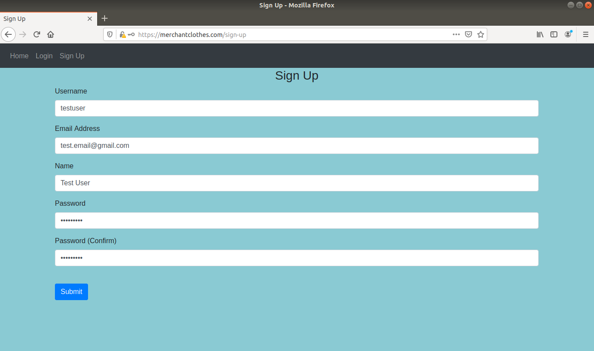
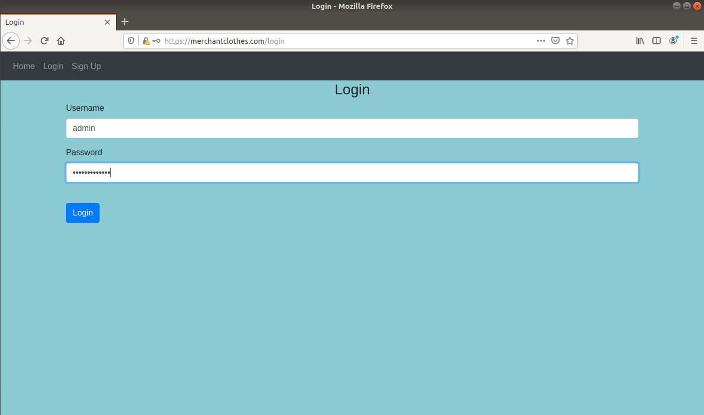
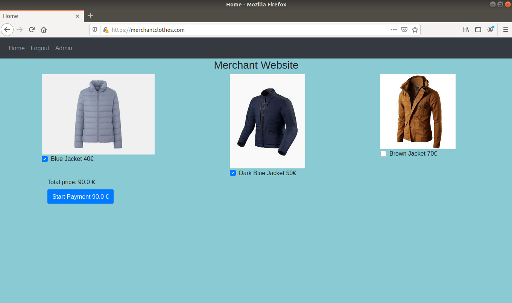
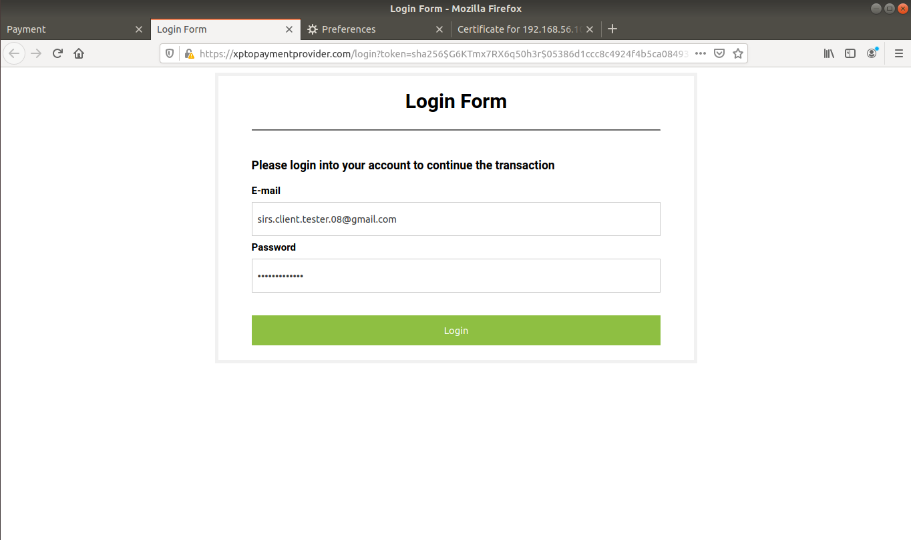
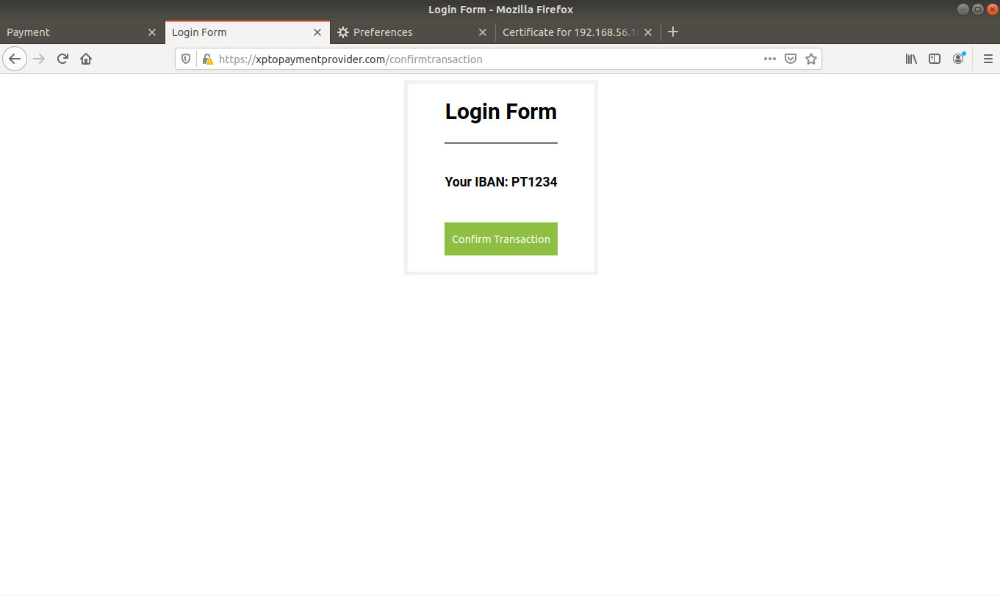
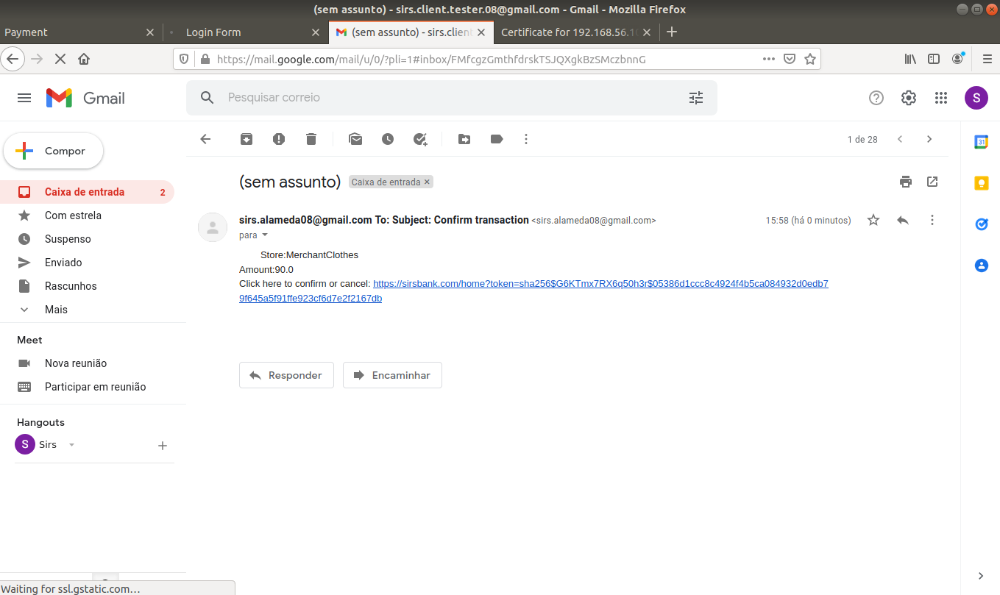
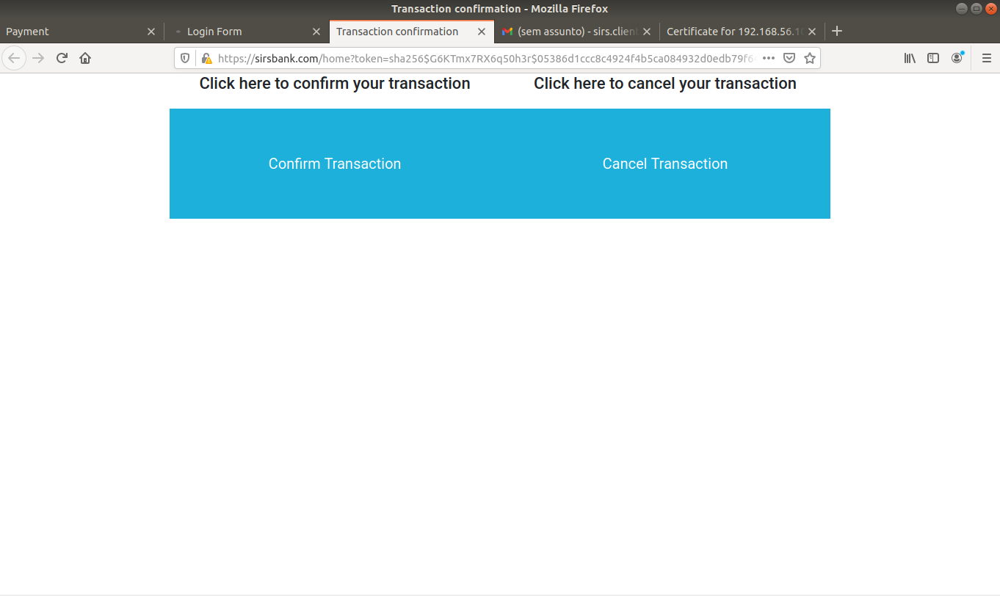
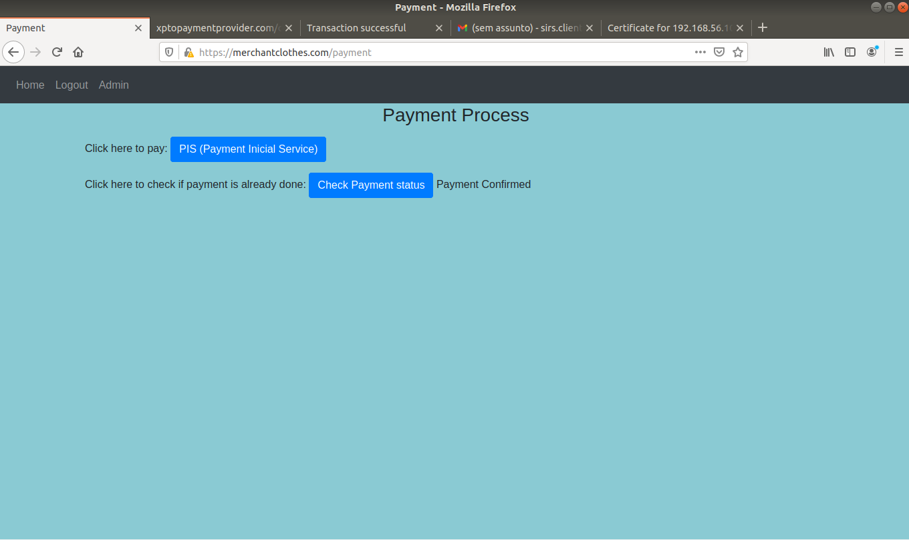

# Web Payments

In this project we have a merchant website were the user is able to buy clothes, the payment process is processed by a PIS(Payment Initiation Service) and PIS is going to comunicate with a Bank execute the payment beetween User and Merchant bank accounts. 

In this README you will find the next sections:
- General Information: Depth view about the project and technologies used.
- Getting started: Prerequisites to run the project, building and run the application
- Demo: Get to know all the features of the project
- Project Information: Project repository, Authors.


## General Information

Merchant website has a authentication system wich allows users to register, login as a user, as admin or navigate in anonymous mode.
When the user wants to pay it will be redirected to the PIS website, where the user will
have to login into his PIS account, which has it's IBAN associated, and then authorize the transaction

PIS will comunicate with the Bank by sending all the information about the transaction.

The bank after receiving this information needs to confirm the transaction with the user by sending him an email.On this email the user receives a link to the Bank's website to confirm or cancel the transaction.

After this the user can go to the Merchant Website and verify if the transaction was confirmed by using "Check status" button.

**Main Security Mechanism:**

All these interactions beetween User and Websites use HTTPS.

Communicatons beetween servers use TLS and we used a custom protocol that allows the bank to verify that the merchant authorizes the transation.

All websites have security mechanism to prevent threats like XSS and SQL injection.

### Built With

* [Python](https://www.python.org/) - Programming Language and Platform
* [Flask](https://flask.palletsprojects.com/en/2.0.x/) - Flask is a web framework
* [gRPC](https://www.openssl.org/) - Remote Procedure Call (RPC) framework
* [OpenSSL](https://maven.apache.org/) -  toolkit software for cryptography and secure communication.
* [SQLite](https://www.sqlite.org/index.html) - SQLite is a library that implements SQL database. 
* [VirtualBox](https://www.virtualbox.org/) - Build Tool and Dependency Management 
* [Vagrant](https://www.vagrantup.com/) - Build Tool and Dependency Management

## Getting Started

### Prerequisites

To run our project, first we need to have installed on our computer:

- Virtual Box
- Vagrant

Instalation commands for Ubuntu(Linux):

-Virtual Box
```
sudo apt-get install virtualbox
```

-Vagrant
```
sudo apt-get install vagrant
```

### Install and Run

- To run our application you just need to get the code from github and get into the folder:

```
git clone 
cd Projeto
```

- Create the self-signed CA(Certificate Authority) and its key, and all the certificates and keys for each server(Merchant, PIS, Bank):

```
chmod +x certs/createKeys.sh
./certs/createKeys.sh
```

The command "./certs/createKeys.sh" will ask for passwords to encrypt our private keys. 
Use this passwords as follow, for simplifying the project porpose:

```
Enter PEM pass phrase: "testca"
Verifying -Enter PEM pass phrase: "testca"

Enter PEM pass phrase: "testwebserver"
Verifying -Enter PEM pass phrase: "testwebserver"
Enter pass phrase for ca-key.pem: "testca"

Enter PEM pass phrase: "testpis"
Verifying -Enter PEM pass phrase: "testpis"
Enter pass phrase for ca-key.pem: "testca"


Enter PEM pass phrase: "testbank"
Verifying -Enter PEM pass phrase: "testbank"
Enter pass phrase for ca-key.pem: "testca"
```


- Run the project:

Run on 4 different terminals each of these commands:
```
vagrant up webserver
vagrant up pisp
vagrant up bank
vagrant up client
```
These commands will deploy 4 virtual machines that will run our project.
You can now test our project like is showned on the Demo section below. 


## Demo

### Assumptions
- **Merchant User**

For the user in Merchant website use admin user or create a account for the website.

Merchant Admin Account:
```
Username: admin
Password: ola12345admin
```

- **PIS User**

PIS already has user account's created which have an IBAN associated.

Account1
```
Email: sirs.client.tester.08@gmail.com
Password: sirsisnice123
```

Account2
```
Email: sirs.client.tester2.08@gmail.com
Password: sirsisnice123
```

- **Bank**

The bank account's are the same that are registered in PIS since they are related to an IBAN. 
So when the bank sends a confimation email for the user, you should check the email used in PIS.

### Start Demo

- On the client VM, access the website https://merchantclothes.com
- Sign Up a user account:



- Or, alternatively, Login to an account or login as Admin:



- Choose the products and click on Payment:



- Now you are on PIS website, where you need to log in with a PIS account:



- Click on button to confirm transaction:



- The bank will receive the comunication of PIS and will send an email for the user
to confirm the transaction

- User will check the email and click on the link that was sent by the bank



- Click to confirm or cancel transaction



- User can check if transaction was done on the Merchant website by clicking on Check Payement Status




## Project Information

### Project Repository

We use [Github](####################) for versioning. 

### Authors

List of [contributors](https://github.com/your/project/contributors) who participated in this project.